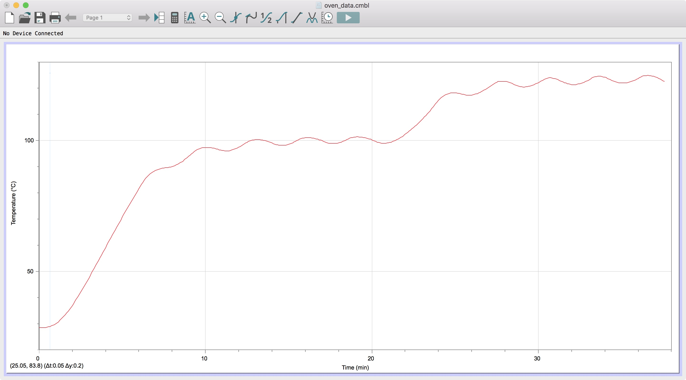

# PID Oven

The goal of this project was to implement a simple PID control loop on an Arduino controller regulating the power to a toaster oven. By turning the oven on and off at varying intervals (I couldn't modify the voltage, just turn it on/off), the controller adjusts the temperature of the oven.

![alt text][pic]

[pic]: oven_controller.jpeg "Logo Title Text 2"

## Algorithm


Only the 5 most recent error values are ever stored by the controller, and they are stored in a rolling array.

```C
// Errors
const int ecount = 5; // amount of previous errors stored
double errors[ecount]; // with 0 as the most recent one, ecount-1 as the oldest
``` 

The integral term is calculated by using a Riemann sum of the 5 most recent error values with respect to time.

```C
ie = 0.0f;
for(int i = 0; i < ecount; ++i)
{
  ie += errors[i];
}
ie *= period;
```

The derivative term is calculated using the 2 most recent error values with respect to time.

```C
de = (errors[0] - errors[1])/period;
```

The control output is intended to fall on the interval `[0.0, 1.0]` (it can accomodate values outside of this range, though). The controller calculates the output using the standard PID model.

*Note: `errors[0]` is equivalent to the proportional term*

```C
double output = kp * errors[0]
              + ki * ie
              + kd * de;
```

## Control Constants

```C
// PID constants
const double kp = 0.5f;
const double ki = 0.01f;
const double kd = 0.5f;
```

## Testing
To test the controller, I started with the oven at room temperature and set the setpoint to 100 °C. Once the oven became stable there, I changed the setpoint to 125 °C. 

*Note: there is an added delay in the graph because I used a separate temperature probe with worse sensitivity than the controller's thermocouple to collect this data*



## Conclusion

Even though the temperature fluctuates, it is usually accurate to within about 5 °C. If I were to go back to this project I would tune it more precisely and try to get the temperature to oscillate even less, but I nonetheless think that my controller fulfilled the project requirements.